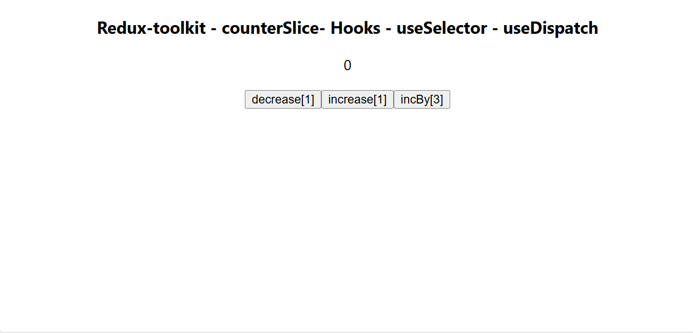

# redux-toolkit-hooks_add_minus_add-by-value

This is a simple Counter application built with ReactJs [function-component] and redux toolkit. just has three buttons one to Plus one, and one to minus one, and other to add by value here i assigned value by 3. just to learn and practice redux toolkit with react"Hooks"

## Table of contents

- [Overview](#overview)
- [Features](#Features)
- [Components](#Components)
  - [App](#App)
  - [Counter](#Counter)
- [Installation](#Installation)
- [Usage](#Usage)
- [Links](#Links)
- [Screenshot](#Screenshot)
- [What I learned](#what-i-learned)
- [Continued development](#continued-development)
- [Author](#author)
- [Acknowledgments](#Acknowledgments)


## overview
This is a simple Counter application built with ReactJs [function-component] and redux toolkit. 
just has three buttons one to Plus one, and one to minus one, and other to add by value here i assigned value by 3
just to learn and practice redux toolkit with react"Hooks"
how to deel with useSelector-useDispatch


## Features
- simple Counter that has three buttons Plus, minus, and add by value

## Components

### App

The main component that has another component called counter 

### Counter
it holds the whole logic


## Installation
To get started with this project, follow these steps:

you can clone the project or download it as Zip file.
1. Clone the repository:
   ```bash
   git clone https://github.com/olahasan/redux-toolkit-hooks_add_minus_add-by-value

2. Navigate to the project directory:
   cd <project-directory>

3. Install the required dependencies:
   npm install   


## Usage
To run the application, use the following command:

npm start


## Links

If you want to open the link in a new tab, you can:

- Press **Ctrl** (or **Cmd** on Mac) while clicking the link.
- Right-click the link and select **Open link in new tab**.

Otherwise, all links will open in the same tab.


- Solution URL: [here](https://github.com/olahasan/redux-toolkit-hooks_add_minus_add-by-value)

- Live Site URL: [here](https://redux-toolkit-hooks-add-by-value.netlify.app/)
  OR [here](https://counter-redux-toolkit-hooks-add-minus-add-by-value.surge.sh/)

 ## Screenshot
 



## what-i-learned
Through this project:
1. I learned in this project how to create react app and treat with function component,
2. how to deal with redux [Redux-toolkit - counterSlice - store - Hooks - useSelector - useDispatch]
3. how to deal with useSelector-useDispatch
4. how to deploy it on netlify and surge

## Continued Development
In the future, I plan to:
- learn more about reactJs Hooks.
- learn more about redux toolkit with reactJs Hooks.

### Author

GitHub - @olahasan

### Acknowledgments

I would like to thank the **[unique coderz academy](https://www.youtube.com/@UniqueCoderzAcademy)** for providing this challenge and to the community for their support.

